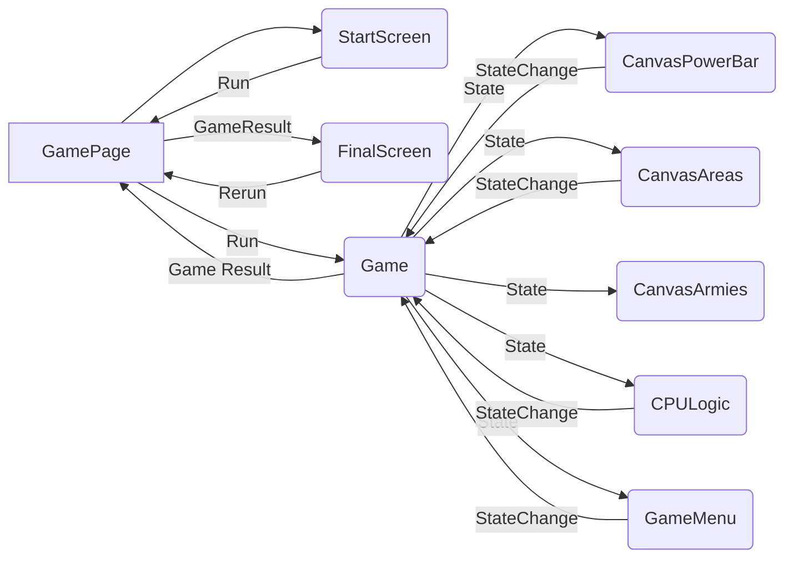

## Диаграмма компонентов игры

## Компоненты игры

**GamePage** базовый компонент игры, имеет три состояния (стартовый экран, игра запущена и финальный экран) и отображает соответствующий компонент:

- **StartScreen**. Начальный экран. Настройки запуска игры и кнопка "Старт"

- **FinalScreen**. Финальный экран игры, демонстрирующий результаты сессии (кто победил, количественные итоги, время сессии)

- **Game**. Сама игра, компонент в котором:
  -- происходит отсчет анимации и исходя из этого изменение состояния игры
  -- состояние игры передается для рендера в компоненты Canvas
  -- состояние игры передается в компоненты отвечающие за отображение интерфейса в процессе игры
  -- состояние игры передается в компоненты отвечающие за логику и действия бота
  -- содержит ряд методов которые вызываются дочерними компонентами (бот совершает действие, игрок совершает действие)

## Дочерние компоненты Game

- **CanvasPowerBar**.
  -- Получает состояние игры из родительского компонента, отображает соотношение сил в игре.
  -- В цикле анализирует соотношения сил и в случае если достигнуты условия победы пользователем или компьютером, то передает в родительский компонент итоги игры и запускает родительский метод завершения игры

- **CanvasArea**.
  -- Получает состояние игры из родительского компонента, отображает локации.
  -- Отслеживает нажатия мыши пользователя в игре и в случае совершения пользователем корректных действий вызывает метод родительского компонента для отправки армий между локациями

- **CanvasArmies**.
  -- Получает состояние игры из родительского компонента, отображает текущее положение армий

- **CPULogic**.
  -- Получает состояние игры из родительского компонента, циклично оценивает возможные ходы для компьютера и при соответствии условиям совершает их (вызывает метод родительского компонента)

- **GameMenu**. Меню отображающееся в ходе игры.
  -- Отображает время сессии.
  -- Присутствует кнопка завершения игры.
  -- В перспективе присутствует кнопка отключения звука игры
